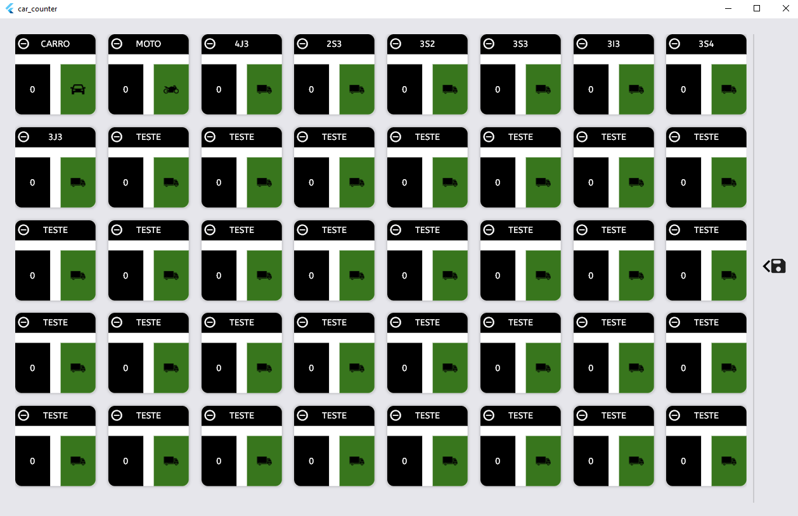
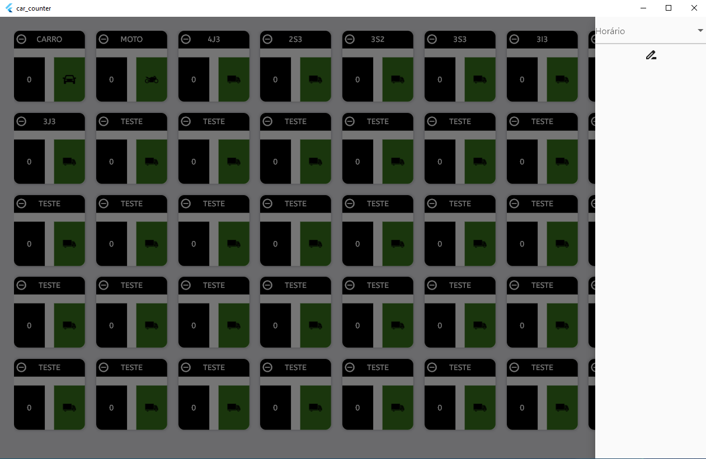
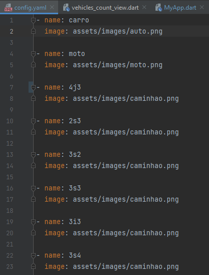

# car_counter

Este projeto tem por objetivo auxiliar tabuladores na contagem de carros. Este trabalho é de suma importancia para a engenharia de tráfego, já que seus dados provem daqui, logo um software adequado para contagem se torna essencial. Por tanto desenvolvi esse software que tem por objetivo auxiliar na contagem de automóveis além de automaticamente gerar o arquivo CSV constando o horário (15 em 15 minutos) da contagem e o número de carros. Para facilitar o uso, há um arquivo yaml em que podem ser inseridos novos dados de veículos que aparecerão automaticamente na aplicação após a sua inicialização.

Neste projeto utilizei: MOBX + CSV(PACKAGE) + YAML(PACKAGE) + GOOGLE_FONTS.

**PROJETO AINDA EM DESENVOLVIMENTO**

____________________

## Imagens do projeto

Seguem algumas imagens do software em funcionamento:

Como pode ser visto o software é customizavel, o próprio usuário pode alterar quais veículos serão contados.

